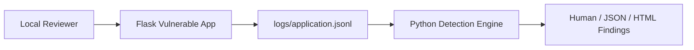

<!-- Intro: Main project runbook for the local OWASP lab detection engine. -->

# OWASP Lab Detection Engine


[](https://github.com/n1wo/owasp-lab-detection-engine/actions/workflows/tests.yml)


OWASP Lab Detection Engine is a local-only cybersecurity learning lab that
combines a deliberately vulnerable Flask web app, structured JSONL security
telemetry, a Python detection engine, and reproducible localhost demo
workflows.

The project currently covers eight OWASP-oriented scenarios: it detects
repeated failed login attempts with `AUTH-BRUTE-FORCE-001`, SQL-injection-like
input with `WEB-SQLI-PATTERN-001`, XSS-like input with `WEB-XSS-PATTERN-001`,
admin-panel privilege escalation with `BAC-PRIV-ESC-001`, server-side
request forgery against internal targets with `WEB-SSRF-INTERNAL-001`,
sensitive configuration disclosed by an exposed debug endpoint with
`CONFIG-EXPOSURE-001`, weak password hashing at registration with
`CRYPTO-WEAK-001`, and sensitive actions performed without an audit or alert
trail with `LOG-GAP-001`.

> **Safety warning:** This project contains intentionally vulnerable examples
> for local educational use only. Do not deploy it to the public internet and
> do not use the demo scripts or detection logic against third-party systems.

## Overview

This project demonstrates:

- secure vs insecure behavior through `LAB_MODE`
- structured security logging from a local Flask app
- safe JSONL parsing with recoverable parse errors
- basic detection engineering with documented rules
- CLI findings in human-readable, JSON, and HTML dashboard formats
- reproducible localhost-only demo activity
- pytest coverage for app behavior, parsing, rules, and demo safety checks

## Features

- [x] Minimal Flask vulnerable app
- [x] Login page
- [x] Search page for SQLi-style local learning
- [x] Comment page for XSS-style local learning
- [x] `LAB_MODE=insecure|secure`
- [x] Insecure mode allows repeated login attempts
- [x] Secure mode uses generic errors and simple lockout behavior
- [x] JSONL telemetry written to `logs/application.jsonl`
- [x] Python JSONL parser
- [x] Admin panel with intentionally broken access control (`/dashboard`)
- [x] Server-side fetch page for SSRF-style local learning (`/fetch`)
- [x] Debug endpoint that leaks config in insecure mode (`/debug`)
- [x] Registration page with weak vs salted password hashing (`/register`)
- [x] Sensitive admin action with missing audit logging (`/admin/role`)
- [x] Detection rule `AUTH-BRUTE-FORCE-001`
- [x] Detection rule `WEB-SQLI-PATTERN-001`
- [x] Detection rule `WEB-XSS-PATTERN-001`
- [x] Detection rule `BAC-PRIV-ESC-001`
- [x] Detection rule `WEB-SSRF-INTERNAL-001`
- [x] Detection rule `CONFIG-EXPOSURE-001`
- [x] Detection rule `CRYPTO-WEAK-001`
- [x] Detection rule `LOG-GAP-001`
- [x] CLI with human-readable and JSON output
- [x] Live SOC alerts at `/soc` from local app telemetry
- [x] Self-contained HTML findings dashboard via `--html`
- [x] Reproducible localhost-only demo scripts
- [x] pytest coverage

## Architecture Overview

| Component | Purpose | Path |
| --- | --- | --- |
| Vulnerable App | Local Flask app that generates login, search, and comment telemetry | `vulnerable-app/` |
| Logs | JSONL security telemetry | `logs/` |
| Detection Engine | Parses logs and produces findings | `detection-engine/` |
| Demo Scripts | Generate local brute-force, SQLi-like, and XSS-like demo activity | `scripts/` |
| Documentation | Architecture, detection rules, demo walkthrough | `docs/` |
| Tests | App, parser, detection, and demo tests | `tests/` |



## Project Structure

```text
.
|-- AGENTS.md                         # Guidance for future AI/code agents
|-- CODE_OF_CONDUCT.md                # Community standards
|-- CONTRIBUTING.md                   # Contribution workflow and safety rules
|-- README.md                         # Project overview and runbook
|-- SECURITY.md                       # Responsible-use policy
|-- docker-compose.yml                # Local Flask app orchestration
|-- requirements-dev.txt              # Test/runtime dependency entry point
|-- .github/                          # CI workflow and issue/PR templates
|-- detection-engine/                 # Python detection engine package
|   |-- README.md
|   `-- detection_engine/
|-- docs/                             # Architecture, demo, rules, threat model
|   |-- architecture.md
|   |-- demo.md
|   |-- detection-rules.md
|   `-- threat-model.md
|-- logs/                             # Sample and generated JSONL telemetry
|   |-- README.md
|   `-- sample-logs.jsonl
|-- scripts/                          # Local-only demo helpers
|   |-- generate_login_demo.py
|   |-- generate_sqli_demo.py
|   |-- generate_xss_demo.py
|   `-- generate_logging_demo.py
|-- tests/                            # pytest test suite
`-- vulnerable-app/                   # Local Flask vulnerable app
    |-- Dockerfile
    |-- README.md
    |-- requirements.txt
    `-- vulnerable_app/
```

## Requirements

- Python 3.10+
- `pip`
- Docker / Docker Compose, required for the interactive Flask lab app
- pytest, installed through `requirements-dev.txt`

The Python test suite can run without Docker. To use the browser-based lab
scenarios, start the app with Docker Compose.

## Quick Start: Copy & Paste

### Step 1: Clone The Repository

```bash
git clone https://github.com/n1wo/owasp-lab-detection-engine.git
cd owasp-lab-detection-engine
```

### Step 2: Create And Activate A Virtual Environment

Windows PowerShell:

```powershell
py -m venv .venv
.venv\Scripts\activate
```

macOS/Linux:

```bash
python3 -m venv .venv
source .venv/bin/activate
```

### Step 3: Install Dependencies

```bash
python -m pip install -r requirements-dev.txt
```

This installs the Flask runtime dependency from `vulnerable-app/requirements.txt`
and pytest for the test suite.

### Step 4: Run Tests

```bash
python -m pytest
```

Current expected result:

```text
105 passed
```

On Windows/OneDrive, pytest may print cache or temp-directory warnings even
when the tests pass. If that happens, run pytest with a repo-local temp folder:

```powershell
python -m pytest --basetemp .pytest_cache\tmp
```

### Step 5: Start The Interactive Lab App

Docker / Docker Compose is required for the browser-based vulnerable app:

```bash
docker compose up --build
```

Then open:

```text
http://127.0.0.1:8080
```

## Fresh Walkthrough

Use this section if you are new to the project and want to understand the whole
local lab flow from start to finish.

The story is:

```text
insecure behavior -> structured JSONL logs -> detection rules -> findings
```

### 1. Start The App In Terminal 1

From the repository root, start the Flask app with Docker Compose:

```powershell
docker compose up --build
```

Keep this terminal open. It is running the local vulnerable app.

When it is ready, the terminal should show that Flask is running on port `8080`.
The browser page should be available at:

```text
http://127.0.0.1:8080
```

The default mode is `insecure`. That is intentional for the lab.

The Flask warning about a development server is expected here because this is a
local-only educational app. Do not deploy it publicly.

### 2. Try The Login Page Manually

Open the app in a browser and try one failed login:

```text
Username: test-user
Password: wrong
```

The app should reject the login with HTTP `401`.

Then try the valid local lab credential:

```text
Username: test-user
Password: lab-password
```

The app should redirect to `/dashboard?username=test-user`.

The successful login appears as HTTP `302` because the app redirects from
`/login` to `/dashboard`.

### 3. Generate Demo Activity In Terminal 2

Open a second terminal from the repository root. Leave Terminal 1 running.

Activate the virtual environment:

```powershell
.venv\Scripts\activate
```

Then generate local demo login activity:

```powershell
python scripts\generate_login_demo.py
```

Expected output:

```text
Generated local login demo activity.
Target: http://127.0.0.1:8080
Failed attempts: 5
Successful attempts: 1
HTTP statuses observed: 401, 401, 401, 401, 401, 302
```

Those statuses mean:

- `401` = failed login
- `302` = successful login redirect to the dashboard

The script only targets `localhost` / `127.0.0.1`.

### 4. Inspect The Generated Logs

The app writes one JSON object per line to:

```text
logs/application.jsonl
```

View the latest events:

```powershell
Get-Content logs\application.jsonl -Tail 10
```

Look for fields such as:

- `event_type`
- `source_ip`
- `username`
- `status_code`
- `lab_mode`
- `reason`
- `success`

If `source_ip` is `172.18.0.1`, that is normal when the app runs in Docker.
It is Docker's internal network address for traffic reaching the container.

### 5. Run The Detection Engine

From the repository root:

```powershell
cd detection-engine
python -m detection_engine --log-file ..\logs\application.jsonl
```

Expected finding:

```text
AUTH-BRUTE-FORCE-001 [Medium]
```

The rule triggers when it sees 5 or more `login_failure` events for the same
`source_ip` and `username` within 5 minutes.

If `event_count` is higher than 5, that usually means the log file contains
events from earlier demo runs too.

### 6. View JSON Findings

For machine-readable output:

```powershell
python -m detection_engine --log-file ..\logs\application.jsonl --json
```

The output contains:

- `findings` - detection results
- `parse_errors` - malformed JSONL lines, if any

An empty `parse_errors` list means the log file parsed cleanly.

### 7. Run The SQLi-Style Search Demo

Go back to the repository root in Terminal 2:

```powershell
cd ..
```

Generate one local SQLi-like search request:

```powershell
python scripts\generate_sqli_demo.py
```

Expected output in insecure mode:

```text
Generated local SQLi-like search demo activity.
Target: http://127.0.0.1:8080
Search path: /search
HTTP status observed: 200
```

The app writes a `suspicious_input` event with:

```text
signal = sql_injection_like_pattern
```

Run the detection engine again:

```powershell
cd detection-engine
python -m detection_engine --log-file ..\logs\application.jsonl
```

Expected additional finding:

```text
WEB-SQLI-PATTERN-001 [Medium]
```

In secure mode, the same search demo should return HTTP `400`, but it still
logs the suspicious input attempt for detection.

If the SQLi demo reports HTTP `404`, the running Docker container is stale.
Stop it and restart with `docker compose up --build`.

### 8. Run The XSS-Style Comment Demo

Go back to the repository root in Terminal 2:

```powershell
cd ..
```

Generate one local XSS-like comment submission:

```powershell
python scripts\generate_xss_demo.py
```

Expected output in insecure mode:

```text
Generated local XSS-like comment demo activity.
Target: http://127.0.0.1:8080
Comment path: /comment
HTTP status observed: 200
```

The app writes a `suspicious_input` event with:

```text
signal = xss_like_pattern
```

Run the detection engine again:

```powershell
cd detection-engine
python -m detection_engine --log-file ..\logs\application.jsonl
```

Expected additional finding:

```text
WEB-XSS-PATTERN-001 [Medium]
```

In secure mode, the same comment demo should return HTTP `400`, but it still
logs the suspicious input attempt for detection.

If the XSS demo reports HTTP `404`, the running Docker container is stale.
Stop it and restart with `docker compose up --build`.

### 9. Optional: Clean The Generated Log

If you want a fresh demo run, stop the app if needed and remove the generated
runtime log:

```powershell
Remove-Item logs\application.jsonl -ErrorAction SilentlyContinue
```

The file is generated by the lab and ignored by git. The committed sample log
at `logs/sample-logs.jsonl` is not affected.

## Run The Lab Locally

Start the vulnerable Flask app with Docker Compose:

```bash
docker compose up --build
```

The app binds to the local loopback interface and should be available at:

```text
http://localhost:8080
```

The default mode is `LAB_MODE=insecure`. To run secure comparison mode:

```bash
LAB_MODE=secure docker compose up --build
```

## Generate Demo Activity

In another terminal from the repository root:

```bash
python scripts/generate_login_demo.py
```

The demo script:

- only targets `localhost` / `127.0.0.1`
- sends 5 failed login attempts for `test-user`
- sends one successful login attempt by default
- writes JSONL login telemetry to `logs/application.jsonl`
- is designed to trigger `AUTH-BRUTE-FORCE-001`

Generate SQLi-like local search activity:

```bash
python scripts/generate_sqli_demo.py
```

The SQLi demo script:

- only targets `localhost` / `127.0.0.1`
- sends one SQLi-like search request to `/search`
- writes `suspicious_input` telemetry to `logs/application.jsonl`
- is designed to trigger `WEB-SQLI-PATTERN-001`

Generate XSS-like local comment activity:

```bash
python scripts/generate_xss_demo.py
```

The XSS demo script:

- only targets `localhost` / `127.0.0.1`
- sends one XSS-like comment submission to `/comment`
- writes `suspicious_input` telemetry to `logs/application.jsonl`
- is designed to trigger `WEB-XSS-PATTERN-001`

Generate logging-failure demo activity:

```bash
python scripts/generate_logging_demo.py
```

The logging demo script:

- only targets `localhost` / `127.0.0.1`
- sends one admin role-change POST request to `/admin/role`
- writes `sensitive_action` telemetry to `logs/application.jsonl`
- is designed to trigger `LOG-GAP-001`

## Inspect Generated Logs

macOS/Linux:

```bash
tail -n 10 logs/application.jsonl
```

Windows PowerShell:

```powershell
Get-Content logs/application.jsonl -Tail 10
```

Each event includes fields such as `timestamp`, `event_type`,
`source_ip`, `username`, `user_agent`, `request_path`, `http_method`,
`status_code`, `lab_mode`, `reason`, and `session_id`.

SQLi-like search and XSS-like comment telemetry also include `signal`,
`input_name`, and `input_value`.

## View Live SOC Alerts

Open the local app's SOC console at:

```text
http://127.0.0.1:8080/soc
```

The SOC console reads `logs/application.jsonl` directly and shows recent local
alerts such as unknown username login attempts, failed logins, lockouts, and
suspicious input. For example, submitting a login with an unknown username in
insecure mode creates a live `AUTH-UNKNOWN-USER-LOCAL` alert.

The detection engine can still generate a standalone HTML report with `--html`
when you want an offline artifact.

## Run The Detection Engine

From the repository root:

```bash
cd detection-engine
python -m detection_engine --log-file ../logs/application.jsonl
```

JSON output:

```bash
python -m detection_engine --log-file ../logs/application.jsonl --json
```

Expected finding:

- Rule: `AUTH-BRUTE-FORCE-001` when the log contains 5 or more
  `login_failure` events for the same `source_ip` and `username` within
  5 minutes
- Rule: `WEB-SQLI-PATTERN-001` when the log contains a `suspicious_input`
  event with `signal` set to `sql_injection_like_pattern`
- Rule: `WEB-XSS-PATTERN-001` when the log contains a `suspicious_input`
  event with `signal` set to `xss_like_pattern`
- Rule: `BAC-PRIV-ESC-001` when the log contains an `admin_access` event with
  `signal` set to `broken_access_control_pattern`
- Rule: `WEB-SSRF-INTERNAL-001` when the log contains an `outbound_request`
  event with `signal` set to `ssrf_internal_target_pattern`
- Rule: `CONFIG-EXPOSURE-001` when the log contains a `config_exposure` event
  with `signal` set to `config_exposure_pattern`
- Rule: `CRYPTO-WEAK-001` when the log contains a `credential_storage` event
  with `signal` set to `weak_password_hash_pattern`
- Rule: `LOG-GAP-001` when the log contains a `sensitive_action` event with
  `signal` set to `logging_failure_pattern`

## Full Demo Flow

macOS/Linux:

```bash
git clone https://github.com/n1wo/owasp-lab-detection-engine.git
cd owasp-lab-detection-engine
python3 -m venv .venv
source .venv/bin/activate
python -m pip install -r requirements-dev.txt
python -m pytest
docker compose up --build
```

In a second terminal, from the repository root:

```bash
source .venv/bin/activate
python scripts/generate_login_demo.py
python scripts/generate_sqli_demo.py
python scripts/generate_xss_demo.py
python scripts/generate_logging_demo.py
cd detection-engine
python -m detection_engine --log-file ../logs/application.jsonl
python -m detection_engine --log-file ../logs/application.jsonl --json
```

Windows PowerShell:

```powershell
git clone https://github.com/n1wo/owasp-lab-detection-engine.git
cd owasp-lab-detection-engine
py -m venv .venv
.venv\Scripts\activate
python -m pip install -r requirements-dev.txt
python -m pytest
docker compose up --build
```

In a second PowerShell terminal, from the repository root:

```powershell
.venv\Scripts\activate
python scripts/generate_login_demo.py
python scripts/generate_sqli_demo.py
python scripts/generate_xss_demo.py
python scripts/generate_logging_demo.py
cd detection-engine
python -m detection_engine --log-file ../logs/application.jsonl
python -m detection_engine --log-file ../logs/application.jsonl --json
```

## Detection Rules

| Rule ID | Goal | Signal | Severity | Status |
| --- | --- | --- | --- | --- |
| `AUTH-BRUTE-FORCE-001` | Detect repeated login failures | 5 `login_failure` events for same `source_ip` + `username` within 5 minutes | Medium | Implemented |
| `WEB-SQLI-PATTERN-001` | Detect SQL injection-like local lab input | `suspicious_input` event with `signal=sql_injection_like_pattern` | Medium | Implemented |
| `WEB-XSS-PATTERN-001` | Detect XSS-like local lab input | `suspicious_input` event with `signal=xss_like_pattern` | Medium | Implemented |
| `BAC-PRIV-ESC-001` | Detect admin-panel privilege escalation via broken access control | `admin_access` event with `signal=broken_access_control_pattern` | High | Implemented |
| `WEB-SSRF-INTERNAL-001` | Detect server-side fetches aimed at internal targets | `outbound_request` event with `signal=ssrf_internal_target_pattern` | High | Implemented |
| `CONFIG-EXPOSURE-001` | Detect sensitive configuration disclosed by an exposed debug endpoint | `config_exposure` event with `signal=config_exposure_pattern` | High | Implemented |
| `CRYPTO-WEAK-001` | Detect passwords stored with a weak (unsalted) hashing algorithm | `credential_storage` event with `signal=weak_password_hash_pattern` | High | Implemented |
| `LOG-GAP-001` | Detect sensitive actions performed without an audit or alert record | `sensitive_action` event with `signal=logging_failure_pattern` | High | Implemented |

## Log Schema

| Field | Description | Example |
| --- | --- | --- |
| `timestamp` | UTC ISO-8601 event timestamp | `2026-06-02T09:00:00Z` |
| `app` | Application name | `vulnerable-app` |
| `environment` | Lab environment label | `local-lab` |
| `event_type` | Event type | `login_failure` |
| `source_ip` | Local/private client address | `127.0.0.1` |
| `username` | Fictional lab username | `test-user` |
| `user_agent` | Client user-agent string | `owasp-lab-demo/1.0` |
| `request_path` | HTTP request path | `/login` |
| `http_method` | HTTP method | `POST` |
| `status_code` | HTTP response status code | `401` |
| `lab_mode` | App behavior mode | `insecure` |
| `reason` | Machine-readable event reason | `bad_password` |
| `session_id` | Fake/local session ID or null | `null` |
| `request_id` | Per-request identifier | `fake-request-001` |
| `success` | Whether login succeeded | `false` |
| `signal` | Suspicious-input signal, when present | `sql_injection_like_pattern` or `xss_like_pattern` |
| `input_name` | Input field name, when present | `q` or `comment` |
| `input_value` | Local lab input value, when present | `test-user' OR '1'='1` |

Supported current `event_type` values:

- `login_success`
- `login_failure`
- `account_lockout`
- `suspicious_input`
- `admin_access`
- `outbound_request`
- `config_exposure`
- `credential_storage`
- `sensitive_action`
- `lab_mode_change`

## Running Tests

```bash
python -m pytest
```

Current test coverage includes:

- Flask app behavior
- secure/insecure login behavior
- structured JSONL logging
- JSONL parser
- invalid JSONL handling
- brute-force detection rule
- SQLi-like pattern detection rule
- XSS-like pattern detection rule
- demo script safety checks
- localhost-only validation

## Documentation

- [Architecture](docs/architecture.md)
- [Demo Walkthrough](docs/demo.md)
- [Detection Rules](docs/detection-rules.md)
- [Threat Model](docs/threat-model.md)
- [Security Policy](SECURITY.md)
- [Agent Guidance](AGENTS.md)

## Roadmap

Completed:

- [x] project structure and documentation
- [x] minimal Flask login scenario
- [x] structured login telemetry
- [x] Python JSONL parser
- [x] `AUTH-BRUTE-FORCE-001`
- [x] SQL injection-style local learning scenario
- [x] `WEB-SQLI-PATTERN-001`
- [x] XSS-style local learning scenario
- [x] `WEB-XSS-PATTERN-001`
- [x] broken access control scenario (admin panel)
- [x] `BAC-PRIV-ESC-001`
- [x] server-side request forgery scenario (internal fetch)
- [x] `WEB-SSRF-INTERNAL-001`
- [x] security misconfiguration scenario (exposed debug endpoint)
- [x] `CONFIG-EXPOSURE-001`
- [x] cryptographic failures scenario (weak password hashing)
- [x] `CRYPTO-WEAK-001`
- [x] security logging & alerting failures scenario (unaudited admin action)
- [x] `LOG-GAP-001`
- [x] reproducible brute-force demo workflow
- [x] reproducible SQLi-like search demo workflow
- [x] reproducible XSS-like comment demo workflow

Planned:

- [ ] optional SIEM/Wazuh export format
- [x] HTML findings dashboard report (`--html`)
- [ ] richer reporting, e.g. trends over time

### OWASP Top 10:2025 Coverage

The lab is organized around the [OWASP Top 10:2025](https://owasp.org/Top10/2025/).
Note that in the 2025 edition SSRF rolled into A01 Broken Access Control, and
SQL injection and XSS both sit under A05 Injection.

Covered:

- [x] A01 Broken Access Control - `BAC-PRIV-ESC-001`, `WEB-SSRF-INTERNAL-001`
- [x] A02 Security Misconfiguration - `CONFIG-EXPOSURE-001` (exposed debug endpoint)
- [x] A04 Cryptographic Failures - `CRYPTO-WEAK-001` (weak password hashing)
- [x] A05 Injection - `WEB-SQLI-PATTERN-001`, `WEB-XSS-PATTERN-001`
- [x] A07 Authentication Failures - `AUTH-BRUTE-FORCE-001` (brute force only)
- [x] A09 Security Logging & Alerting Failures - `LOG-GAP-001` (unaudited admin action)

Planned scenarios (each: vulnerable route, secure-mode comparison, JSONL signal,
detection rule, tests, docs):

- [ ] A10 Mishandling of Exceptional Conditions - fail-open auth/validation path
  and stack-trace leakage on error; rule `FAIL-OPEN-001` (high priority, new 2025
  category)
- [ ] A08 Software or Data Integrity Failures - insecure deserialization or
  tampered signed-cookie/data trust; rule `INTEGRITY-FAILURE-001`
- [ ] A06 Insecure Design - business-logic flaw by design, e.g. reset/transfer
  with no identity proof or quantity/price manipulation; rule `DESIGN-LOGIC-001`
- [ ] A03 Software Supply Chain Failures - known-bad pinned dependency or tampered
  build artifact; static manifest/lockfile check rather than runtime telemetry
  (lower feasibility for this log-driven lab)

## Portfolio Relevance

This project demonstrates practical Python and Flask development, structured
security telemetry, JSONL log parsing, basic detection engineering, CLI output
design, pytest coverage, and careful documentation for a safe local lab. It is
intended to show a responsible security mindset without presenting the project
as a production monitoring system.

## Responsible Use

This lab is intentionally vulnerable and must remain local. It is intended for
learning defensive security concepts, telemetry, and detection engineering.
