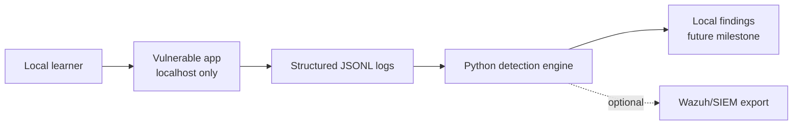

# Architecture

This document describes the local lab architecture. The vulnerable app has a
minimal login implementation; the detection engine is still planned.

## Components

### Vulnerable App

The vulnerable app is a local Flask web application with configurable
vulnerable and secure modes. The current implementation includes a login page
and emits structured logs for login outcomes.

### Structured Logs

The app writes JSONL events containing fields such as timestamp,
event type, source IP, username, path, status code, and a short message. Logs
should use local/private example values only.

### Detection Engine

The future Python detection engine will read local JSONL logs, normalize
events, apply documented detection rules, and emit local findings. It should
focus on defensive detection behavior rather than offensive instructions.

### Optional SIEM/Wazuh Export

Later milestones may add an export format suitable for importing findings into
Wazuh or another local SIEM-style tool.

## Data Flow

## Local-Only Boundary

The architecture assumes a local lab environment. The vulnerable application
should bind to localhost or another private local interface and should not be
published as a public service.
