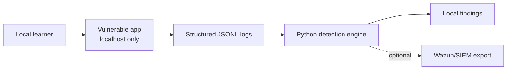

<!-- Intro: Component map and data-flow explanation for the local lab architecture. -->

# Architecture

This document describes the local lab architecture. The vulnerable app has a
minimal login implementation plus local search, comment, admin-panel,
server-side fetch, debug-endpoint, registration, admin-action, profile-import,
and checkout scenarios, and a detection engine that parses JSONL logs for
brute-force, SQLi-like, XSS-like, broken-access-control, SSRF,
security-misconfiguration, cryptographic-failure, logging-failure,
unsafe-object-trust, and business-logic-abuse pattern detection.

## Components

### Vulnerable App

The vulnerable app is a local Flask web application with configurable
vulnerable and secure modes. The current implementation includes a login page,
a search page, a comment page, an admin panel guarded by a broken access
control check, a server-side fetch page, a debug diagnostics endpoint, an
account registration page, a sensitive admin role-change action, a serialized
profile import page, a checkout page, and structured logs for login outcomes,
suspicious input, admin access, outbound requests, configuration exposure,
credential storage, sensitive actions, profile imports, and business actions.

### Structured Logs

The app writes JSONL events containing fields such as timestamp,
event type, source IP, username, user agent, request path, HTTP method, status
code, lab mode, reason, and session ID. Logs should use local/private example
values only.

Current telemetry schema:

| Field | Description |
| --- | --- |
| `timestamp` | UTC ISO-8601 event timestamp |
| `event_type` | `login_success`, `login_failure`, `account_lockout`, `suspicious_input`, `admin_access`, `outbound_request`, `config_exposure`, `credential_storage`, `sensitive_action`, `profile_import`, `business_action`, or `lab_mode_change` |
| `source_ip` | Local/private client address |
| `username` | Fictional local lab username |
| `user_agent` | Client user-agent string, when provided |
| `request_path` | HTTP path that produced the event |
| `http_method` | HTTP method such as `POST` or `GET` |
| `status_code` | HTTP response status code |
| `lab_mode` | `insecure` or `secure` |
| `reason` | Short machine-readable reason |
| `session_id` | Fake/local session identifier when available, otherwise `null` |
| `signal` | Suspicious-input signal such as `sql_injection_like_pattern` or `xss_like_pattern`, when present |
| `input_name` | Submitted field name for suspicious input, when present |
| `input_value` | Local lab input value for suspicious input, when present |

### Detection Engine

The Python detection engine reads local JSONL logs, normalizes events, applies
implemented detection rules, and emits local findings. Current rules are
`AUTH-BRUTE-FORCE-001`, `WEB-SQLI-PATTERN-001`, `WEB-XSS-PATTERN-001`,
`BAC-PRIV-ESC-001`, `WEB-SSRF-INTERNAL-001`, `CONFIG-EXPOSURE-001`,
`CRYPTO-WEAK-001`, `LOG-GAP-001`, `INTEGRITY-DESERIALIZE-001`,
`DESIGN-LOGIC-001`, `FAIL-OPEN-001`, and `SUPPLY-CHAIN-001`. The engine should
focus on defensive detection behavior rather than offensive instructions.

### Optional SIEM/Wazuh Export

Later milestones may add an export format suitable for importing findings into
Wazuh or another local SIEM-style tool.

## Data Flow

## Local-Only Boundary

The architecture assumes a local lab environment. The vulnerable application
should bind to localhost or another private local interface and should not be
published as a public service.
